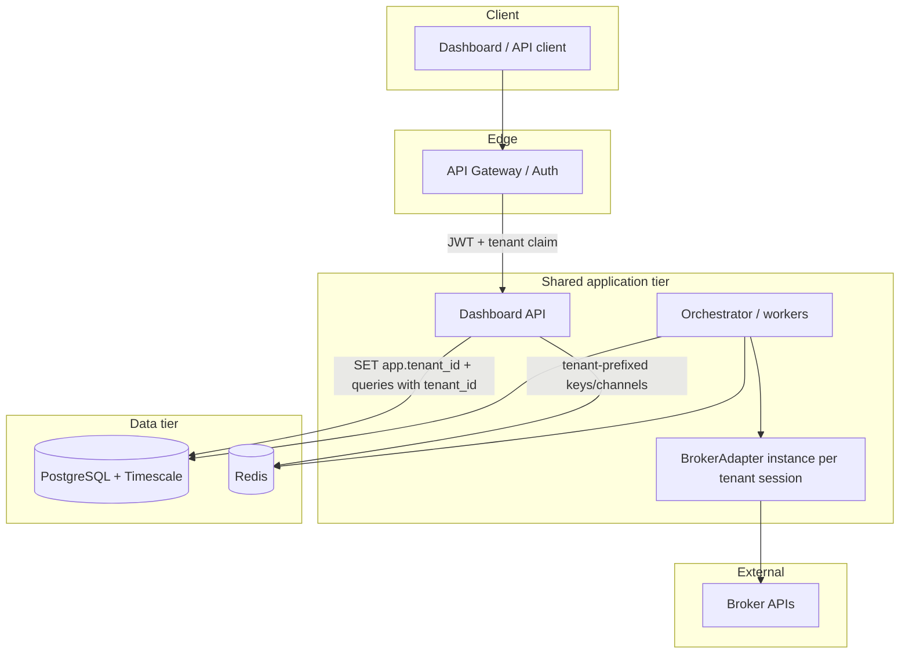

# ADR 0002: Multi-tenant isolation model

## Status

Accepted

## Context

The Director and future clients share one core engine (strategies, risk, scheduling) but must have strict isolation of market data, executions, credentials, and proprietary strategy definitions. The architecture must make cross-tenant access difficult by default and detectable in review.

## Decision

**Hybrid model: shared application and database schema, hard `tenant_id` boundary everywhere.**

1. **Data plane**

   - **PostgreSQL / TimescaleDB:** Single schema (or small number of shared schemas). Every business table includes `tenant_id NOT NULL`. Hypertables for time series (bars, ticks, fills) use composite keys `(tenant_id, time, ...)`.
   - **Row-level security (RLS):** Enable PostgreSQL RLS on tenant-owned tables; policies force `tenant_id = current_setting('app.tenant_id')` (or equivalent session variable set by the API layer after JWT validation). Application code still passes `tenant_id` explicitly in queries as defense in depth.
   - **No queries without tenant filter:** Repository layer convention: methods require `tenant_id` as the first parameter after `self`; generic `get_by_id` is forbidden unless scoped.

2. **Cache and pub/sub (Redis)**

   - Keys: `tenant:{tenant_id}:...` for all mutable state; never use a global key for tenant-owned data.
   - Channels: `tenant:{tenant_id}:events`, `tenant:{tenant_id}:bars:{symbol}`, etc. Consumers subscribe only to their tenant’s channels.

3. **Message queues**

   - Queue or topic names are tenant-prefixed, or messages carry `tenant_id` and workers validate it against the authenticated job context before side effects.

4. **Object storage (if used)**

   - Prefix `s3://bucket/tenants/{tenant_id}/...` for exports, models, and audit artifacts.

5. **Configuration**

   - `ALLOWED_TENANT_IDS` (or future IAM) gates which tenants exist in an environment. Per-tenant broker choice and encrypted secrets live in tenant configuration tables, not env vars, except for platform-level secrets.

6. **Request path**

   - API gateway or FastAPI dependency resolves identity → `tenant_id` → sets request context (contextvar). Downstream services read context; if missing, halt and log (no default tenant).

## Alternatives considered

- **Schema-per-tenant** — Cleaner blast radius, painful migrations and connection fan-out at scale; may be revisited for regulated subsets of tenants.
- **Database-per-tenant** — Maximum isolation; operational cost and backup complexity too high for initial product stage.
- **Siloed deployments per client** — Simple mentally; undermines shared engine and increases release drift.

## Consequences

- **Positive:** One migration applies to all tenants; monitoring and backups are unified.
- **Positive:** Broker abstraction + tenant id on every row align with adapter method signatures.
- **Negative:** A bug that omits `tenant_id` in a raw SQL string is catastrophic; mitigated by RLS, linters, and code review checklist.
- **Broker abstraction:** Adapters load credentials by `(tenant_id, account_id)` only; no global singleton broker client for all tenants.

## Security boundaries (data flow)

Isolation rule: no arrow may carry another tenant’s identifier unless the actor is a break-glass admin with audited access (out of scope for default product path).

## Data Engineer handoff (storage sketch)

| Area | Table / object pattern | Notes |
|------|------------------------|--------|
| Bars / quotes | `market_bars (tenant_id, symbol, interval, ts, ...)` | Timescale hypertable partitioned by time; index `(tenant_id, symbol, interval, ts DESC)`. |
| Orders / fills | `orders`, `fills` with `tenant_id` | FKs and RLS; `broker_order_id` opaque string. |
| Credentials | `tenant_broker_credentials` | Encrypted blob; no plaintext secrets in logs. |
| Strategy registry | See ADR 0003 | `owner_tenant_id` nullable for platform-owned. |

## Orchestrator handoff

- Job payloads must include `tenant_id`; workers validate before calling `BrokerAdapter` or DB.
