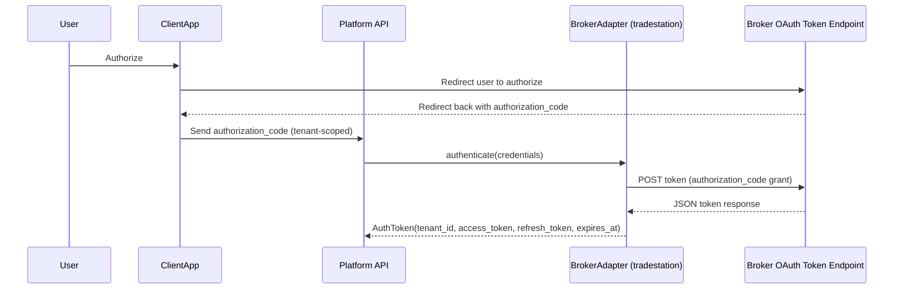

# DRAFT — Pending Security Architect sign-off (P1-03)

## TS OAuth flow (Phase 1 — Task 7)

This document describes the **draft** OAuth implementation under `src/brokers/tradestation/`.

### Goals (Phase 1)

- Implement **Authorization Code** exchange and **Refresh Token** exchange only.
- Keep **all vendor-specific URLs/paths/JSON fields** inside `src/brokers/tradestation/`.
- Ensure **no token/secret values** are emitted in logs or exception messages.

### Sequence (step-by-step)

1. **User authorizes**
   - The client application sends the user to the broker authorization page (UI handled elsewhere).
   - The broker redirects back to your `BROKER_REDIRECT_URI` with an `authorization_code`.

2. **Code exchange (server-side)**
   - Platform calls:
     - `tradestation adapter authenticate(BrokerCredentials(...authorization_code...))`
   - Adapter calls:
     - `exchange_authorization_code(...)` in `src/brokers/tradestation/auth.py`
   - Result:
     - Returns `AuthToken(tenant_id, access_token, refresh_token, expires_at, ...)`

3. **Refresh**
   - Platform calls:
     - `tradestation adapter refresh_token(AuthToken(...refresh_token...))`
   - Adapter calls:
     - `refresh_access_token(...)` in `src/brokers/tradestation/auth.py`
   - Result:
     - Returns a new `AuthToken` with updated `access_token` and `expires_at`.

### Error handling (typed, non-leaky)

`src/brokers/tradestation/auth.py` maps failures to broker-agnostic exceptions:

- `BrokerNetworkError`: network/timeout errors from httpx.
- `BrokerAuthError`: 400/401/403 and other non-success responses.
- `BrokerRateLimitError`: 429 responses.
- `BrokerValidationError`: malformed JSON or missing required fields like `access_token`.

No raw HTTP response bodies are included in exception messages.

### Mermaid diagram

### Token lifetime notes

- `expires_at` is derived from `expires_in` if present; otherwise it is left `None`.
- Refresh-token rotation behavior depends on broker settings; the draft code accepts refreshed `refresh_token` when present.

